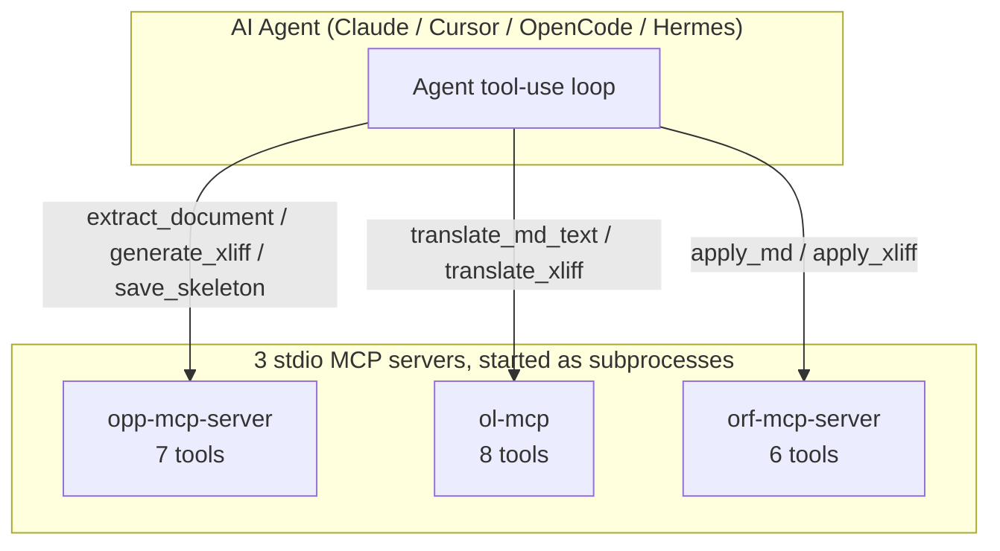

# Omni Suite — Architecture

> **Audience**: developers and architects integrating, extending, or operating the
> Omni Suite. End-user quick-start lives in `README.md` and per-module `README.md`s.
>
> **Scope**: cross-module concerns. Per-module internals live in each sub-repo's
> own documentation (see [References](#references) below).

---

## 1. What is the Omni Suite?

A 3-stage **document localization pipeline** that takes a document in one
language, translates it, and writes the translated result back into a
same-format (or different-format) document.

| Stage | Module | Role |
|-------|--------|------|
| 1 | **OPP** (`Omni_Pre_Processor`) | Extract source document → MD + XLIFF + skeleton |
| 2 | **OL** (`Omni_Localizer`) | Translate MD / XLIFF between languages |
| 3 | **ORF** (`Omni_Re_Formatter`) | Backfill translated content into a target document |

The three modules are **independent** (each has its own git repo, PyPI package,
CLI, and MCP server) and **composable** (any version combination in
`VERSION_COMPATIBILITY.md` is contract-tested end-to-end).

---

## 2. Pipeline Diagram

```mermaid
flowchart LR
    subgraph S1["Stage 1: OPP (Extract)"]
        A[Source document<br/>DOCX / PPTX / PDF / XLSX / ...] --> B[Pipeline]
        B --> C1[document.md]
        B --> C2[document.xlf]
        B --> C3[document_manifest.json]
        B --> C4[document.skeleton.zip]
    end

    subgraph S2["Stage 2: OL (Translate)"]
        D1[document.md] --> E1[ol translate-md]
        D2[document.xlf] --> E2[ol translate-xliff]
        E1 --> F1[translated.md]
        E2 --> F2[translated.xlf]
    end

    subgraph S3["Stage 3: ORF (Backfill)"]
        G1[translated.md] --> H1[orf apply-md]
        G2[translated.xlf] --> H2[orf apply-xliff]
        C4 -.skeleton.zip.-> H2
        C3 -.manifest.json.-> H2
        H1 --> I1[result.{target_format}]
        H2 --> I2[result.{target_format}]
    end

    C1 --> D1
    C2 --> D2
    F1 --> G1
    F2 --> G2
```

ASCII fallback for terminals that don't render Mermaid:

```
  source.docx
       │
       ▼
  ┌──────────────────┐
  │  OPP extract     │   ── produces ──▶  document.md
  │  (Omni_Pre_      │                    document.xlf
  │   Processor)     │                    document_manifest.json
  └──────────────────┘                    document.skeleton.zip
       │                                       │            │
       │ document.md / document.xlf           │            │
       ▼                                       │            │
  ┌──────────────────┐                        │            │
  │  OL translate    │   ── produces ──▶  translated.md    │
  │  (Omni_Localizer)│                    translated.xlf   │
  └──────────────────┘                        │            │
       │                                       │            │
       │ translated.md / translated.xlf        │            │
       ▼                                       ▼            ▼
  ┌──────────────────────────────────────────────────────────┐
  │  ORF backfill         apply-md  ─▶  result.<fmt>          │
  │  (Omni_Re_Formatter)  apply-xliff ─▶ result.<fmt>        │
  │                        (consumes skeleton.zip + manifest) │
  └──────────────────────────────────────────────────────────┘
```

### Two channels

There are two parallel channels through the pipeline:

| Channel | Intermediate format | Best for | What ORF needs from OPP |
|---------|---------------------|----------|-------------------------|
| **MD channel** | Markdown | Layout-tolerant pipelines, simple formats (HTML, CSV, JSON) | `document.md` (+ `images.json` for image injection) |
| **XLIFF channel** | XLIFF 1.2/2.0 | Format-preserving backfill (DOCX, PPTX) with inline-formatting tags | `document.xlf` + `document.skeleton.zip` + `document_manifest.json` |

The same DOCX can go through either channel; the choice trades layout fidelity
for simplicity. The 36-path matrix in the parent `README.md` documents which
combinations are production-verified.

---

## 3. Module-by-Module Contracts

### 3.1 OPP — `Omni_Pre_Processor`

**Input**: a single document (one of DOCX, PPTX, PDF, XLSX, CSV, JSON, XML,
HTML, EPUB, EML, MSG, image, IPYNB, or `.url` for YouTube auto-detect).

**Output** (in `--output-dir`):

| File | Required for MD channel | Required for XLIFF channel | Purpose |
|------|------------------------|----------------------------|---------|
| `{base_name}.md` | ✓ | | Markdown with YAML frontmatter (`source_lang`, `target_lang`) |
| `{base_name}.xlf` | | ✓ | XLIFF 1.2/2.0 with `<bx>`/`<ex>` inline tags |
| `{base_name}_manifest.json` | | ✓ | Source info, extraction stats, image metadata |
| `{base_name}.skeleton.zip` | | ✓ | Original OOXML ZIP structure preserved for backfill |
| `images.json` (optional) | ✓ (for image injection) | | Image manifest for ORF `apply_md` |
| `{base_name}_images/` (optional) | ✓ | | Image files referenced from `images.json` |

**Format guards** (deliberate, do not "fix" without an ADR):

- **PDF → XLIFF is blocked.** OPP enforces a case-insensitive guard because
  PDF cannot be backfilled into a structural DOCX/PPTX layout. Use the MD
  channel for PDF.
- **PDF → MD is allowed** but limited to text-only extraction.

**Public surface**: see `Omni_Pre_Processor/README.md` for CLI flags and the
seven MCP tools (`extract_document`, `batch_extract`, `detect_format_tool`,
`generate_markdown`, `generate_xliff`, `save_skeleton`, `ping`).

### 3.2 OL — `Omni_Localizer`

**Input**:

- MD text (CLI: `ol translate-md <file> -s <src> -t <tgt> -o <dir>`)
- XLIFF file (CLI: `ol translate-xliff <file> --source-lang <src> --target-lang <tgt> -o <dir>`)
- Plain text via MCP (`translate_md_text(content=...)`)

**Output**: a translated file written to `--output` / `output_dir`. MCP
text-in/text-out tools return the translated string in the response payload;
file-based tools (`translate_xliff`) write to disk.

**FAKE_LLM seam**: every entry point honors `OMNI_TEST_FAKE_LLM=1` to swap
the LLM client for a deterministic mock. **This is the contract** for any
test environment — real API keys must never be required for a green CI.

**Glossary & TM**: optional. `load_glossary(path)` reads a JSON glossary;
`search_tm(source_text, tmx_path, threshold)` queries a TMX translation
memory. The eight MCP tools cover the full surface.

### 3.3 ORF — `Omni_Re_Formatter`

**Input**:

- MD file → `apply_md` produces any of 16 formats: DOCX, ODT, EPUB, HTML,
  RTF, PDF, PPTX, ICML, SRT, CSV, XLSX, XML, IPYNB, EML, MSG, JSON.
- XLIFF file + `input_file` (typically the OPP skeleton) → `apply_xliff`
  backfills the original layout. **Use `--force` for cross-format
  conversions** (e.g. DOCX XLIFF → PPTX); without it, ORF refuses a
  skeleton/output format mismatch with a clear error.
- Optional `images=[{path, position, ...}]` for image injection.

**Output**: a single file at the requested `output_path`. ORF validates the
extension against a whitelist (DOCX/ODT/EPUB/HTML/RTF/PDF/PPTX/ICML/SRT) and
rejects `apply_md` outputs for `.xlsx`/`.csv`/`.json`/`.ipynb`/`.eml` — those
formats need `batch_convert` instead.

**Six MCP tools**: `apply_md`, `apply_xliff`, `batch_convert`, `detect_format`,
`info`, `ping`.

### 3.4 Handoff contract: `manifest.json` + `skeleton.zip`

When OPP finishes a DOCX/PPTX extraction, it writes:

```
output_dir/
├── document.md
├── document.xlf
├── document_manifest.json     ← required by ORF apply_xliff
└── document.skeleton.zip      ← required by ORF apply_xliff
```

`document_manifest.json` shape (current `manifest_version: "1.0"`):

```json
{
  "manifest_version": "1.0",
  "tool": "OPP",
  "tool_version": "<opp-version>",
  "source": {
    "file_path": "/abs/path/to/spec.docx",
    "original_filename": "spec.docx",
    "format": "DOCX",
    "file_size_bytes": 45824,
    "file_hash_md5": "a1b2c3d4e5f6..."
  },
  "extraction": {
    "source_lang": "en",
    "target_lang": "zh",
    "outputs": {
      "markdown":  { "path": "spec.md", "paragraph_count": 150, "table_count": 3 },
      "xliff":     { "path": "spec.xlf", "trans_unit_count": 42 }
    },
    "images":    [ { "mime_type": "image/png", "width": 800, "height": 600, "data_size_bytes": 24580 } ],
    "warnings":  []
  },
  "resources": { "storage_dir": "resources", "image_count": 5 },
  "skeleton":  {
    "path": "spec.skeleton.zip",
    "format": "ZIP",
    "key_files": ["word/document.xml", "word/styles.xml", "[Content_Types].xml"]
  }
}
```

`document.skeleton.zip` is the original DOCX/PPTX ZIP with key files preserved:

| Source format | Files preserved in skeleton |
|---------------|------------------------------|
| DOCX | `word/document.xml`, `word/styles.xml`, `word/numbering.xml`, `word/settings.xml`, `[Content_Types].xml` |
| PPTX | All `ppt/*` files (slides, layouts, media) |

**Contract rule**: when ORF's `apply_xliff` is invoked with an `input_file`
that came from OPP's `save_skeleton`, the manifest's `format` must match the
target `--format`. ORF validates this and raises a clear error otherwise; the
operator can override with `--force` (see `Omni_Re_Formatter/README.md` for
the cross-format override semantics).

**Floating image contract** (DOCX only): OPP emits `is_floating: true` and
`wp_anchor_h` / `wp_anchor_v` (in EMU, 914400 = 1 inch) in `images.json` for
anchored drawings. ORF reads these to reinject `<wp:anchor>` blocks with
`<wp:positionH>`/`<wp:positionV>` during backfill, preserving the original
page layout. Inline images keep the legacy JSON shape (no `is_floating`
key) so older consumers stay unaffected.

---

## 4. MCP Server Topology

Each module ships its own Model Context Protocol (MCP) server over stdio.
All three implement the same `mcp.server.Server` + `stdio_server` pattern
(the legacy `fastmcp` 3.4.2 stdio bug was fixed in Phase 1 — see
`.omo/notepads/2026-06-22-production-readiness-plan/learnings.md`).



| Server | Module | Entry point | Tools | Config env var |
|--------|--------|-------------|-------|----------------|
| `opp-mcp-server` | OPP | `Omni_Pre_Processor/src/opp/mcp/server.py` | 7 | `OPP_MCP_ALLOWED_DIRS` |
| `ol-mcp` | OL | `Omni_Localizer/src/ol_mcp/server.py` | 8 | (none — uses `OL_CONFIG_PATH`) |
| `orf-mcp-server` | ORF | `Omni_Re_Formatter/src/orf/mcp/server.py` | 6 | `ORF_MCP_ALLOWED_DIRS` |

**Total: 21 tools** (7 + 8 + 6). Each server has a `ping` health-check tool.
MCP server names are historically inconsistent (OPP/ORF carry `-server`,
OL does not) — this is a known wart, not a bug, and changing it now would
break existing client configurations.

**Per-server security stack** (mirrors across all three):

- `PathValidator` enforces an allowlist of directories; rejects paths
  containing `..` or symlinks that escape the allowlist.
- `check_auth` accepts `MCP_SHARED_SECRET` (omitted in dev).
- `check_rate_limit` caps per-process request rate.
- `mcp_error_boundary` (OPP/ORF) / `OL_INVALID_INPUT` error code (OL)
  catches unhandled exceptions and returns structured errors.

**Cross-tool orchestration**: an agent can call all three servers in one
request, passing the OPP `output_dir` of one step as OL's `input_path` and
then OL's `output_dir` as ORF's `file_path`. Sample chained tool call is
in `AGENTS.md` → "Full pipeline (chain all three MCP tools)".

**Test entry points** for the servers (per `AGENTS.md` → "MCP Local Testing
Guide"):

```bash
# OPP
python -m opp.mcp.server                    # or: opp mcp
# OL
python -m ol_mcp                            # or: ol mcp
# ORF
python -m orf.mcp.server                    # or: orf mcp
```

---

## 5. Cross-Module Data Flow

End-to-end, with the file artefacts at each handoff:

```
┌──────────────────────────────────────────────────────────────────────────┐
│  (caller / agent / CLI)                                                   │
└──────────────────────────────────────────────────────────────────────────┘
            │ file_path
            ▼
   ┌────────────────┐
   │  OPP CLI /     │   detect_format → extractor → channels (MD / XLIFF)
   │  opp-mcp-server│   → resource_manager → manifest + skeleton writer
   └────────────────┘
            │ writes {md, xlf, manifest, skeleton, images} to output_dir
            ▼
   ┌────────────────┐
   │  OL CLI /      │   shield → translate → repair → unshield (MD)
   │  ol-mcp        │   XLIFF in-place target rewrite
   └────────────────┘
            │ writes translated file
            ▼
   ┌────────────────┐
   │  ORF CLI /     │   apply_md:   MD + images → pandoc / pure-python
   │  orf-mcp-server│   apply_xliff: xlf + skeleton + manifest → backfill
   └────────────────┘
            │ writes result.<target_format>
            ▼
   ┌──────────────────────────────────────────────────────────────────────┐
   │  (caller / agent / CLI)                                               │
   └──────────────────────────────────────────────────────────────────────┘
```

**Stateless design**: each module is invoked per-document. There is no
shared state between OPP → OL → ORF. All handoff state lives in the file
artefacts (`.md`, `.xlf`, `manifest.json`, `skeleton.zip`, `images.json`).
This is what makes the three modules independently deployable and the
pipeline horizontally parallelizable.

**Error boundaries**:

- OPP failures abort the pipeline; the partial `output_dir` may contain
  the `.md` without the `.xlf`. Caller decides whether to retry or fall
  back to MD-only.
- OL failures leave the OPP output untouched. Caller should preserve OPP
  artefacts for retry.
- ORF failures do not touch the OL output. ORF returns the original
  exception wrapped in a structured error.

---

## 6. Observability Story

The current state is **partial** — we are mid-migration to a uniform
observability story (see Phase 4 in
`.omo/plans/2026-06-22-production-readiness-plan.md` § 7.1).

| Concern | OPP | OL | ORF | Suite |
|---------|-----|----|-----|-------|
| Text logs | ✓ `python-json-logger` | ✓ basic | ✓ basic | — |
| Structured JSON logs | partial (text format) | ✗ | ✗ | — |
| Prometheus / OTel metrics | dep only, no instrument | ✗ | ✗ | — |
| Distributed tracing | ✗ | ✗ | ✗ | — |
| `ping` MCP health check | ✓ | ✓ | ✓ | — |
| Tier 7/8 matrix verification | — | — | — | ✓ `scripts/format_matrix_verifier.py`, `scripts/mcp_matrix_verifier.py` |
| Version matrix log | — | — | — | ✓ `VERSION_COMPATIBILITY.md` |
| Pre-commit (`omni-contract-smoke`) | — | — | — | ✓ manual stage |

**Today, operators get visibility from**:

1. **MCP `ping`** — every server exposes a health check, agents can poll.
2. **Per-process text logs** — each module logs to its own file under
   `Omni_*/logs/`. The parent suite does not aggregate them.
3. **Tier 8 matrix gate** — `omo_loop.py --gate tier8` runs the
   real-MCP end-to-end matrix and produces PASS/FAIL/SKIP counts per cell.
   The latest verified run (2026-06-22) is 20 PASS / 145 SKIP / 0 FAIL on
   the full MD matrix; the SKIPs are format- and dependency-related, not
   regressions.
4. **`tests/integration/test_version_compat.py`** — runs the full
   OPP → OL → ORF CLI pipeline on a minimal DOCX against the current
   pinned versions. Catches version drift before release.

**Planned (Phase 4)**:

- Migrate all three modules to `structlog` (JSON output, standard fields:
  `module`, `tool`, `duration_ms`, `file`, `format`).
- Add OTel/Prometheus metrics per module (`<module>_<operation>_total`,
  `<module>_<operation>_duration_ms`).
- Span each CLI invocation; OPP/OL/ORF become child spans linked by
  `trace_id` propagated via the artifact filenames (no in-process state).

---

## 7. Key Design Decisions

| # | Decision | Rationale | Where it lives |
|---|----------|-----------|----------------|
| 1 | **Three independent modules, not a monolith** | Each team can ship at its own cadence; `pip install opp` works without OL or ORF. | `Omni_*/pyproject.toml` × 3 |
| 2 | **Two parallel channels (MD + XLIFF)** | MD is simpler; XLIFF preserves inline formatting tags. Choice is per-document. | `Omni_Pre_Processor/README.md` (Pipeline section) |
| 3 | **`manifest.json` + `skeleton.zip` as the OPP → ORF contract** | The manifest is small, machine-readable, and versioned (`manifest_version`); the skeleton preserves the original layout without forcing OPP to know about ORF's internals. | `Omni_Pre_Processor/src/opp/cli.py:392-457`, `Omni_Re_Formatter/src/orf/...` |
| 4 | **PDF → XLIFF is blocked at OPP** | A PDF cannot be backfilled into a structural DOCX/PPTX layout. The case-insensitive guard is intentional. | `Omni_Pre_Processor/src/opp/...` (PDF guard) |
| 5 | **FAKE_LLM seam (`OMNI_TEST_FAKE_LLM=1`)** | Tests must never require real API keys. The seam is the contract for CI and local dev. | All three modules |
| 6 | **MCP over stdio, one server per module** | Stdio is the only transport agents uniformly support; one server per module keeps failure domains and security allowlists independent. | `Omni_*/src/*/mcp/server.py` × 3 |
| 7 | **Cross-format XLIFF needs `--force`** | ORF's default is to refuse a format-mismatched backfill (e.g. DOCX xlf → PPTX) because silent fallbacks lose layout. `--force` makes the override explicit. | `Omni_Re_Formatter/src/orf/cli.py` |
| 8 | **Coordinate releases via `bumpversion.py` + `VERSION_COMPATIBILITY.md`** | The three modules version independently (different teams, different cadences) but every shipped combination must be matrix-tested before it lands in the compat table. | `scripts/bumpversion.py`, `VERSION_COMPATIBILITY.md` |
| 9 | **(removed 2026-06-24) src/Omni_*/ git submodules no longer exist** | OPP/OL/ORF are now regular top-level directories. The `.gitmodules` entries were dropped; `scripts/sync_shallow.sh` is now a deprecation stub. | `.gitmodules` (removed), `scripts/sync_shallow.sh` (stub) |
| 10 | **Single shared venv at `.venv_ol/` (Python 3.13)** | Eliminates "wrong venv" bugs. `.venv/` (Python 3.12) is deprecated. | `.venv_ol/`, `README.md` (Environment section) |

---

## 8. Version Topology

Three independent SemVer streams, pinned together for each release by
`VERSION_COMPATIBILITY.md`:

```
opp ──── MD / XLIFF ────▶ ol ──── MD / XLIFF ────▶ orf
 │                          │                         │
 └──── images.json ─────────┘                         │
 └──── skeleton.zip ────────────────────────────────┘
 └──── manifest.json ───────────────────────────────┘
```

| Module | Current version | Repo | Package name |
|--------|-----------------|------|--------------|
| OPP | 0.9.1 | `1StepMore/Omni_Pre_Processor` | `omni-pre-processor` (imports as `opp`) |
| OL | 0.7.1 | `1StepMore/Omni_Localizer` | `omni-localizer` |
| ORF | 0.4.17 | `1StepMore/Omni_Re_Formatter` | `omni-re-formatter` |
| omni-suite | 0.4.0 | `1StepMore/e2e-test-suite` (this repo) | meta-package, print-only CLI |

**Version policy** is documented in `docs/API_STABILITY.md` (companion
document in this directory). Cross-module coordination is recorded in
`VERSION_COMPATIBILITY.md` and `scripts/bumpversion.py`.

---

## 9. Repository Layout

```
Omni_Suite/                              ← this repo (parent / test suite)
├── Omni_Pre_Processor/                  ← OPP standalone git repo
│   ├── src/opp/                         ← package source
│   │   ├── pipeline.py                  ← OPPPipeline orchestrator
│   │   ├── extractors/                  ← per-format extractors
│   │   ├── channels/                    ← MD / XLIFF formatters
│   │   ├── cli.py                       ← CLI (generates manifest + skeleton)
│   │   └── mcp/server.py                ← MCP server (7 tools)
│   ├── pyproject.toml                   ← version 0.9.1
│   └── README.md
├── Omni_Localizer/                      ← OL standalone git repo
│   ├── src/ol_mcp/                      ← MCP server (21 tools)
│   ├── src/ol/                          ← package source
│   ├── pyproject.toml                   ← version 0.7.1
│   └── README.md
├── Omni_Re_Formatter/                   ← ORF standalone git repo
│   ├── src/orf/                         ← package source
│   │   ├── cli.py                       ← CLI (apply-md / apply-xliff)
│   │   └── mcp/server.py                ← MCP server (6 tools)
│   ├── pyproject.toml                   ← version 0.4.17
│   └── README.md
├── tests/                               ← parent suite tests (30+ files)
│   ├── integration/test_version_compat.py
│   ├── observability/                   ← 38 tests
│   ├── security/                        ← 63 tests
│   ├── mcp/                             ← MCP smoke / e2e
│   ├── e2e_*.py                         ← per-channel E2E
│   └── conftest.py                      ← shared fixtures
├── scripts/
│   ├── bumpversion.py                   ← coordinated 3-module version bump
│   ├── mcp_matrix_verifier.py           ← real-MCP end-to-end matrix
│   ├── format_matrix_verifier.py        ← CLI pipeline matrix
│   ├── fidelity_checker.py              ← pipeline fidelity scoring
│   ├── setup_dev.sh                     ← one-shot dev install
│   └── sync_shallow.sh                  ← submodule SHA sync
├── docs/                                ← umbrella documentation (you are here)
│   ├── ARCHITECTURE.md
│   ├── API_STABILITY.md
│   ├── ACCEPTANCE.md
│   ├── ERROR_CODES.md
│   ├── SECURITY.md
│   └── T14_LIMITATION.md
├── VERSION_COMPATIBILITY.md             ← tested (opp, ol, orf) combinations
├── .omo/                                ← operational plans & notepads
│   ├── plans/2026-06-22-production-readiness-plan.md
│   └── notepads/2026-06-22-production-readiness-plan/learnings.md
├── pyproject.toml                       ← root workspace (Phase C1)
├── .venv_ol/                            ← shared Python 3.13 venv
└── README.md
```

---

## 10. References

### Suite-level
- `README.md` — Cross-Format Production-Readiness matrix (36 verified paths)
- `VERSION_COMPATIBILITY.md` — tested (opp, ol, orf) version combinations
- `AGENTS.md` — quick start, MCP configs, local MCP testing guide
- `.omo/plans/2026-06-22-production-readiness-plan.md` — Phase 0–4 plan; § 13 version strategy, § 14 rollback/migration

### Per-module
- **OPP**: `Omni_Pre_Processor/README.md` — extractor reference, format table, `manifest.json` schema, skeleton key-files table
- **OL**: `Omni_Localizer/README.md` — translation pipeline, glossary & TM support
- **ORF**: `Omni_Re_Formatter/README.md` — 16 output formats, `--force` cross-format semantics, image injection

### Companion docs (in this directory)
- `docs/API_STABILITY.md` — SemVer commitment, deprecation policy, contract test strategy
- `docs/ERROR_CODES.md` — cross-module exit-code table
- `docs/SECURITY.md` — path validation, auth, rate limiting, CVE policy
- `docs/ACCEPTANCE.md` — production-readiness acceptance criteria
- `docs/T14_LIMITATION.md` — known limitations
